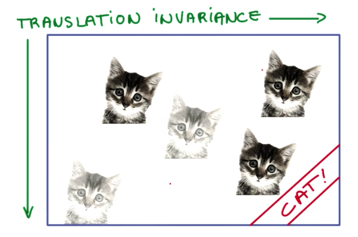
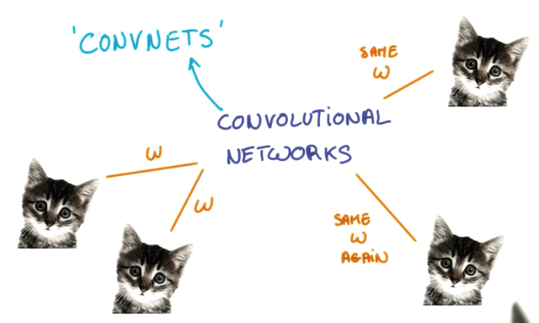
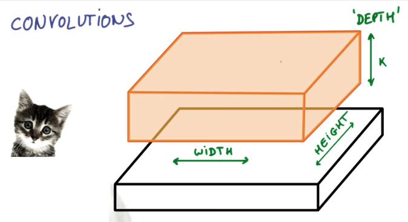
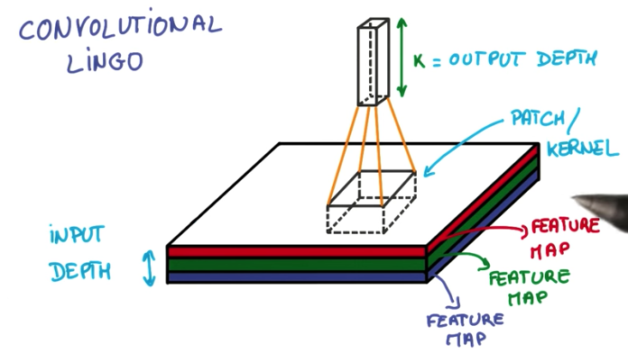
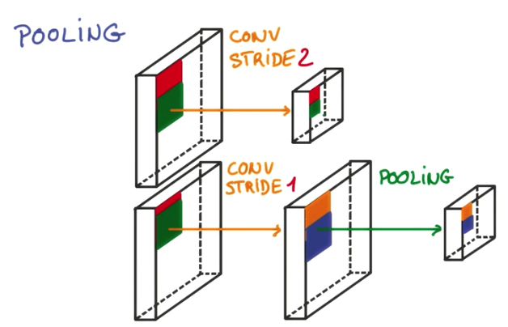
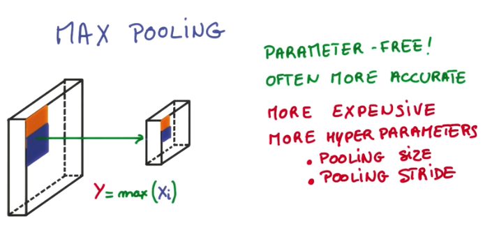
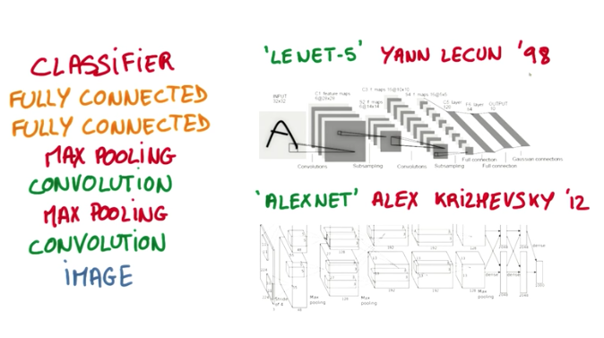

# Convolutional Neural Networks

## Structure helps learning

If our input data presents some structure, we can leverage it to design our neural network. In this way, we have to do less training and the network will generally perform better. Take the example below. If our model has to output only the letter that is presented in some image, it doesn't need to learn about the colors of the image. So it will learn about the letters faster if we use grey scale pictures to train it, instead of colored ones.

## Statistical invariance

Another example of structured data that helps to train models faster is images containing some feature. For example, an image with a kitten on the left corner, is the same as an image with a kitten on the center, or on the right corner, for the purpose of identifying kittens. So if we can leverage that to train models faster. This phenomena is called `translation invariance`

The same idea can be applied to text. For example, a noun like `kitten` will most likely have the same meaning, disregarding where it occurs on the text.

We can use this `statistical invariance` (i.e. features that don't change on average across time or space) to our benefits while designing neural networks by using a technique called `weight sharing`. Weight sharing is when we share the weights of inputs that represent the same information, therefore training them at the same time.

## ConvNets

Convolutional Neural Networks (or ConvNets for short) are neural networks that share their weight parameters across space.

To understand CNNs, we have to understand what is a convolution.

A convolution is when we have some input, for example an image: width x height x depth (RGB), and take patches of it, with lesser dimension, and apply some function to these patches resulting in an output with lesser width and height, but higher depth than the input.   

On the image example, the output of the convolution of a 256x256 image with 3 channels RGB, could be a 128x128x16 3D Matrix, like shown below.

While a regular neural network has various layers of matrix multiplications, a convolutional neural network consists of a pyramid of convolutions and on the top sits a classifier.

## Convolutional Lingo

There are various terms related to ConvNets.

- *Patch* or *kernel* is the subset of pixels of an image that is taken as input by each node of a CNN.
- *Feature Map* is each layer of the depth dimension of the input. For example, an RGB image contains 3 feature maps.

- *Stride* is the distance between each patch.

- *Padding* is the strategy applied to fill the convolution output (or not). This can be `same padding` or `valid padding`.
    - `Same padding` consists of filling the output with zeros so that the width and height match those of the input.
    - `Valid padding` doesn't fill the output with zeros, leaving it with a different size than the input.

## Pooling

Pooling is a technique to reduce the size of the image in order to make the convnet more efficient. It consists of taking the max of a subset of pixels. For example, given an output of the convolution layer, we take 2x2 pixels and select the maximum value. In this example, after the pooling layer, the output will be reduced to width/2 * height*2.

The greatest advantages of applying max pooling instead of increasing the stride to reduce the output is the accuracy. Increasing stride results in information loss, while max pooling takes into account all the pixels in the neighborhood to select the maximum value.

The disadvantage of max pooling is that the model requires more computing to train and predict and also increases the number of hyperparameters to tune.

Some famous CNN Architecture consist of 2 convolution layers interleaved with 2 pooling layers that feeds 2 dense layers and then output the classification. These architectures were used to create two ConvNets that won world challenges in the past, called `LENET-5` and `ALEXNET`.

Besides Max Pooling, average pooling is also another useful pooling technique, which provides a blurred version of the image as an output.

