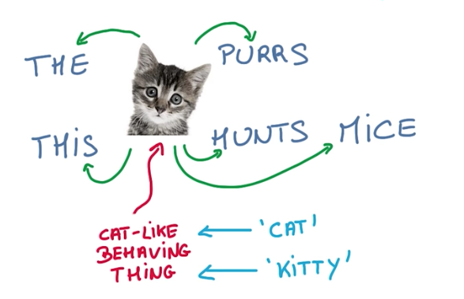
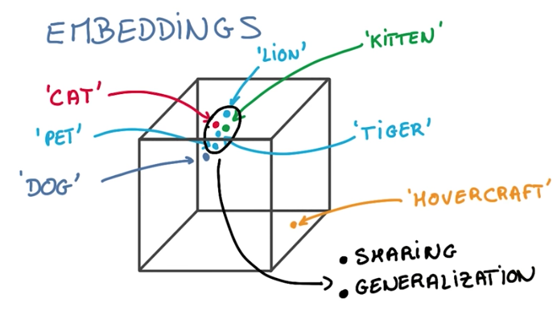
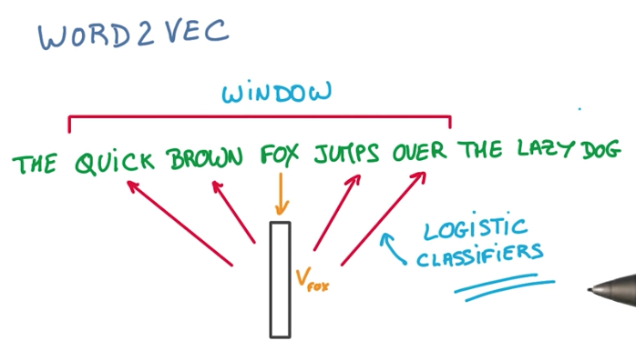
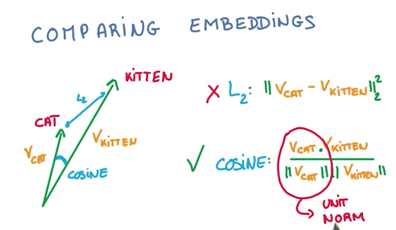

# Deep Models for Text and Sequences

## Challenges for working with texts

In text, usually words that occur with the least frequency are the most important to derive meaning from the text. For example, "do" is a common word and doesn't help a model to classify a document. In contrast, "retinopathy" is a very rare word, that occurs 0.00001% in English, and the document will be most likely a medical document. These rare events are a problem in deep learning, because ideally, we want to have lots of data to train on.

Another problem is that we can use different words that have the same meaning. This means that the model will have to learn about these semantic relations, which means that we'll need to feed lots of training data with labels to it.

A solution to these problems is to use Unsupervised Learning. This is a good solution because of two reasons:
- There is lot of textual data available for our models to train upon
- Similar words tend to appear in similar contexts

## Embeddings

The idea to generalize on text is that by learning to sort the *things* that belong into some *context*, our model will understand what are those *things*.

Take for example the phrases:
- The *cat* purrs
- The *cat* hunts mice

*Cat* can be replaced by any cat-like entity. For instance, *kitty* would provide the same meaning on the sentences. So if a model is successful in understanding that cat and kitty can both be used on these sentences, we can say that the model has learned the meaning of cat and kitty on this context.

To learn about the context of a word, we'll model the words using embeddings. Embeddings are small vectors that map words with similar meaning into similar vectors in a word-space dimension.

## Word2vec

Word2vec is a simple model that works surprisingly well. As an example, we take a sentence, and create an embedding for each word in it. Initially a random one. Then we train the model, using a Logistic Classifier and the words inside a window around the original word.

There are 2 details about word2vec:

- when comparing embeddings, we should use cosine distance and unitary norms, because the length of the embedding vector is irrelevant for the comparison purpose.

- when training, instead of comparing the softmax vector to the possible words, instead of using the full corpus vocabulary, we can sample it and select, along with the target, some other words that are not the target. This doesn't impact the accuracy of the model, but greatly increase its performance.

Finally, as a side-note, to visualize the embeddings vectors, we should use t-SNE instead of PCA, for dimensionality reduction. That is, because t-SNE preserves the similarity and distance between vectors, while PCA could deform this.

