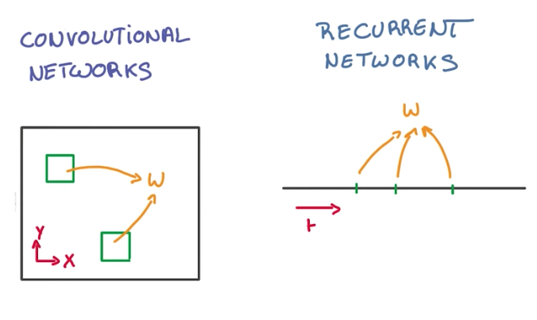
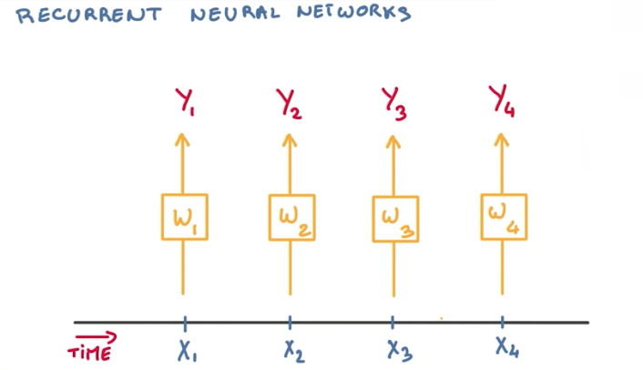
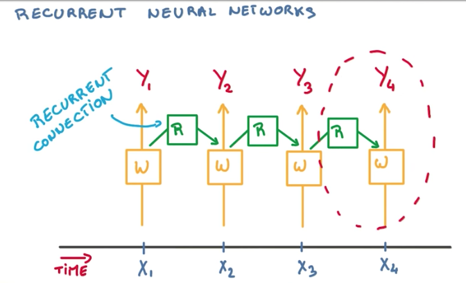
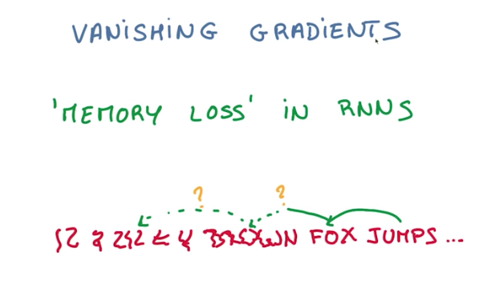
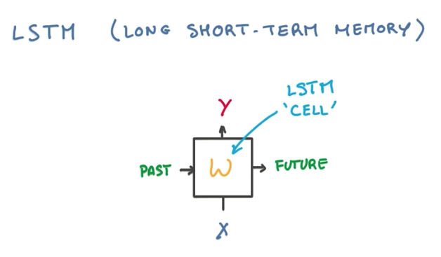

# Deep Models for Text and Sequences

## Challenges for working with texts

In text, usually words that occur with the least frequency are the most important to derive meaning from the text. For example, "do" is a common word and doesn't help a model to classify a document. In contrast, "retinopathy" is a very rare word, that occurs 0.00001% in English, and the document will be most likely a medical document. These rare events are a problem in deep learning, because ideally, we want to have lots of data to train on.

Another problem is that we can use different words that have the same meaning. This means that the model will have to learn about these semantic relations, which means that we'll need to feed lots of training data with labels to it.

A solution to these problems is to use Unsupervised Learning. This is a good solution because of two reasons:
- There is lot of textual data available for our models to train upon
- Similar words tend to appear in similar contexts

## Embeddings

The idea to generalize on text is that by learning to sort the *things* that belong into some *context*, our model will understand what are those *things*.

Take for example the phrases:
- The *cat* purrs
- The *cat* hunts mice

*Cat* can be replaced by any cat-like entity. For instance, *kitty* would provide the same meaning on the sentences. So if a model is successful in understanding that cat and kitty can both be used on these sentences, we can say that the model has learned the meaning of cat and kitty on this context.

To learn about the context of a word, we'll model the words using embeddings. Embeddings are small vectors that map words with similar meaning into similar vectors in a word-space dimension.

## Word2vec

Word2vec is a simple model that works surprisingly well. As an example, we take a sentence, and create an embedding for each word in it. Initially a random one. Then we train the model, using a Logistic Classifier and the words inside a window around the original word.

There are 2 details about word2vec:

- when comparing embeddings, we should use cosine distance and unitary norms, because the length of the embedding vector is irrelevant for the comparison purpose.

- when training, instead of comparing the softmax vector to the full corpus vocabulary, we can sample it and select, along with the target, some other words that are not the target. This doesn't impact the accuracy of the model, but greatly increase its performance.

Finally, as a side-note, to visualize the embeddings vectors, we should use t-SNE instead of PCA, for dimensionality reduction. That is, because t-SNE preserves the similarity and distance between vectors, while PCA could deform it.

## Sequences of Varying Length

So far we have seen only inputs with fixed size. This makes it easy to turn inputs into vectors and feed them to a Neural Network. The problem is that in the real world, texts (and speech) don't have a fixed number of words, but instead a varying number of words. To solve this problem, we will use Recurrent Neural Networks.

## Recurrent Neural Networks

While CNNs use shared parameters to extract patterns in space (2D, 3D, etc.), Recurrent Neural Networks (or RNNs for short) use a similar approach but over time, instead of space.

So the general idea for working with text, is that we want to take inputs from events in time, and classify them as they come.

If the sequence is reasonably [stationary](https://en.wikipedia.org/wiki/Stationary_sequence), we can simplify things and use the same model (with the same weights) for all incoming events.

But because we are working with a sequence of text, we want to take into account the previous events, while evaluating future events, so our model has a better understanding of the context of the words. This can be achieved by feeding previous events recurrently to all future classifications.

To achieve better performance, a better approach is to use the state of the previous classifier recursively as a summary of what happened before.

The problem this approach introduces is that for some large sequence of text, we would require a very deep neural network to hold the state of all previous events. To solve this problem, we use tying again, and only keep the state of the previous model.

This final architecture is pretty simple. We have our network connecting to each input in time, and a recurrent connection connecting our network with its previous state, to summarize the context of our sequence of inputs.

## Backpropagation through time

With the current architecture proposed to RNNs, we still have some problems.

To compute all the weights of the network, we would need to backpropagate through time. This means that we would have to compute the derivatives of all the weights used recurrently throughout all events. This is bad for SGD because it produces correlated updates, while SGD expects uncorrelated updates.

These correlated updates causes 2 problems:
- Exploding gradients: when the derivatives get too big too fast, causing the gradient to explode into infinity.
- Vanishing gradients: when the derivatives get too small too fast, causing the gradient to vanish into zero.

We are going to solve these 2 problems in very different ways.

## Exploding Gradient Solution

To fix the exploding gradient problem, we use a hack that is very effective and cheap: *gradient clipping*. In order to prevent the gradient from growing unbounded, we can compute its norm, and shrink the update step when the norm grows too big.

## Vanishing Gradient Problem Explained

The vanishing gradient problem is more difficult to fix. This problem makes our model remember only the recent events and forget about the distant past. This makes our RNNs not work well after a few time steps.

## LSTM

This is where LSTM (Long short-term memory) comes in. LSTM solves the vanishing gradient problem, by replacing our recurrent connections with a very simple machine that prevents this memory loss.

