# Deep Neural Networks

## Linear Model Benefits

Linear models provide various benefits:

So we want to keep using linear models. But we need to introduce some non-linearity into these models to better represent other functions. Multiplying `W` by linear functions, doesn't solve this problem.

## RELUs

The easiest way to introduce non-linearities is to use the Rectified Linear Unit functions (RELU).

And the derivative from this function is also easy to compute.

## Linear Models + RELUs = Neural Networks

So using RELUs, we can introduce non-linearities into our model and build our first neural network.

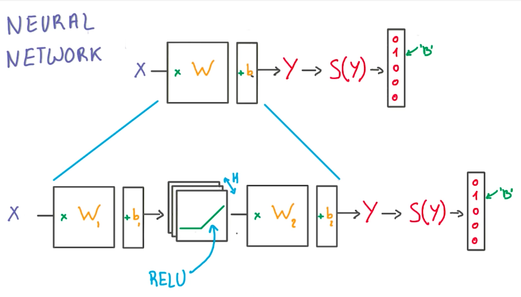

But where are the neurons?

In this class, we won't make analogies to the biological neuroscience side of neural networks. Instead, we will focus on the math behind it, and how we can use GPUs to make them work with little effort as possible.

## 2-Layer Neural Networks

**Note**: Depicted above is a "2-layer" neural network:

1. The first layer effectively consists of the set of weights and biases applied to X and passed through ReLUs. The output of this layer is fed to the next one, but is not observable outside the network, hence it is known as a *hidden layer*.
2. The second layer consists of the weights and biases applied to these intermediate outputs, followed by the softmax function to generate probabilities.

## Chain Rule

The advantages of using simple linear operations to build neural networks is that it makes it easy to compute the derivatives due to the `chain rule`. This also makes it easy for a deep learning framework to manage and promotes data reuse for further computational optimization.

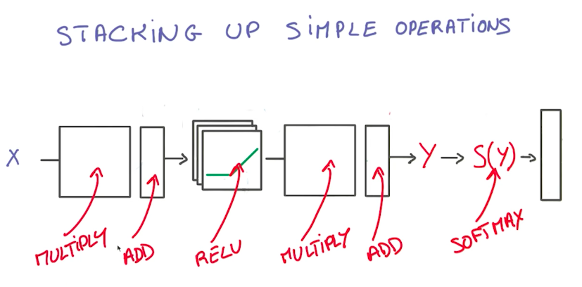

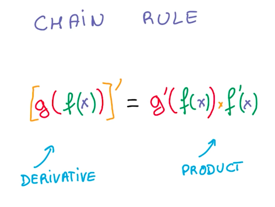

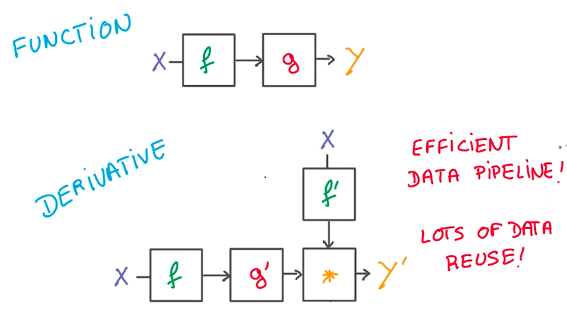

## Back-propagation

Optimization of the model consists in running forward-propagation and then back-propagation to retrieve gradients for the weights. We then update the weights and run the process again a large number of times, until the model is optimized. It is good to note that the back-propagation step often takes twice the memory and the time to compute as the forward-propagation steps.

## Training a Deep Neural Network

When training a neural network, we can choose to add more nodes or add more layers. Below is a 2-layer neural network with 1 hidden layer, which is not very deep yet.

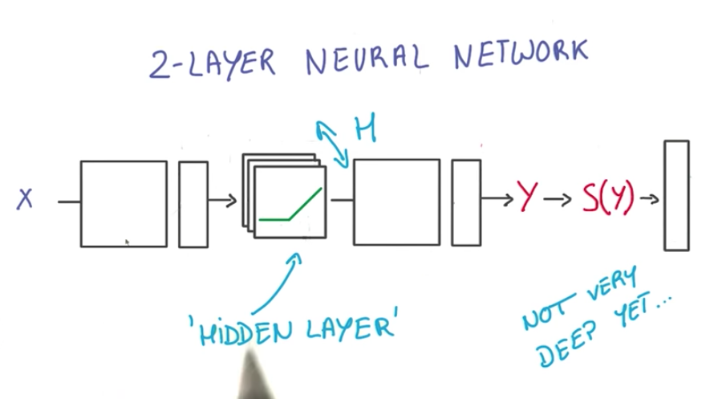

Usually, it is better to add more layers (go deeper) than add more nodes (go wider), because of parameter efficiency.

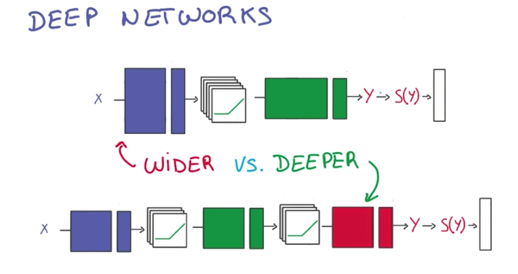

Another advantage is that a lot of natural phenomena tend to have a hierarchical structure, which deep models capture.

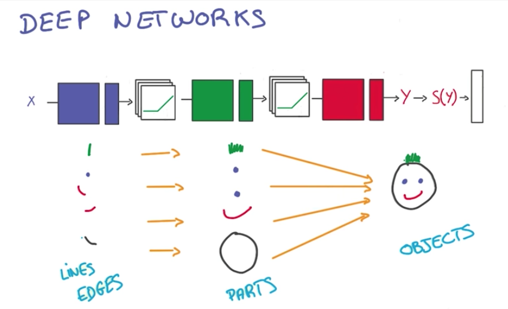

Finally, we add more layers by stacking RELUs and `WX + b` operations.

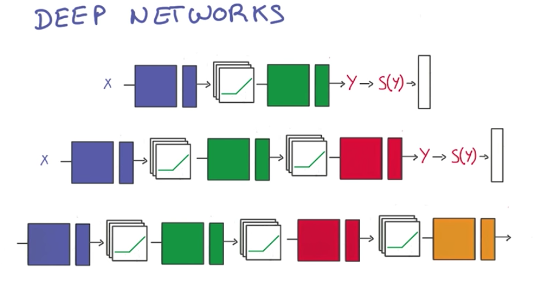

## Early Termination

Early termination is a technique to prevent overfitting.

It consists of interrupting the training process when we stop gaining performance on the validation set.

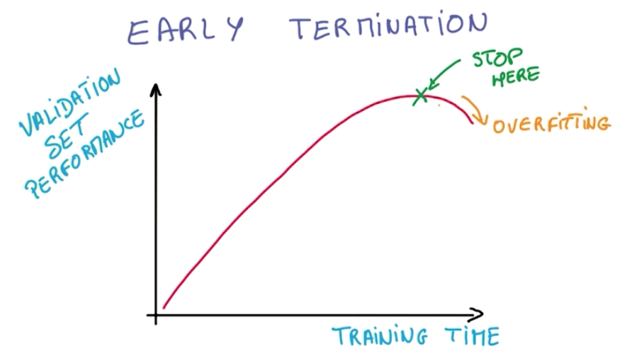

## Regularization

Regularization is another technique to prevent overfitting on neural networks.

It consists of setting some boundaries in which the weights can be modified.

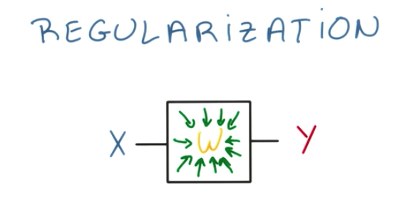

As an analogy, we can understand regularization as a Stretch vs Skinny Jeans. Skinny Jeans would mean overfitting. Because we don't want to overfit, we set a constraint to leave more "space" for the weights.

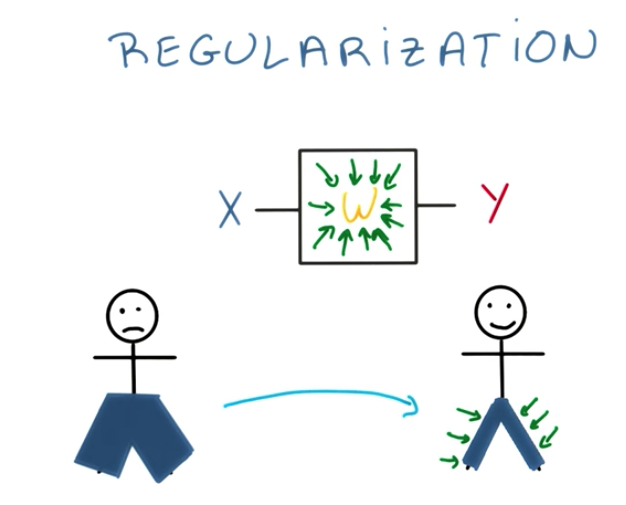

In machine learning, regularization is implemented using L2 Regularization.

It consists of adding a term to the loss function, which penalizes large weights. And it introduces another hyperparameter.

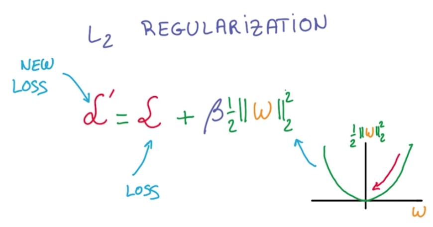

It is also good to note that its cheap to compute the derivative of this new term, meaning it doesn't incrase the cost of the computation of the derivative of the loss function.

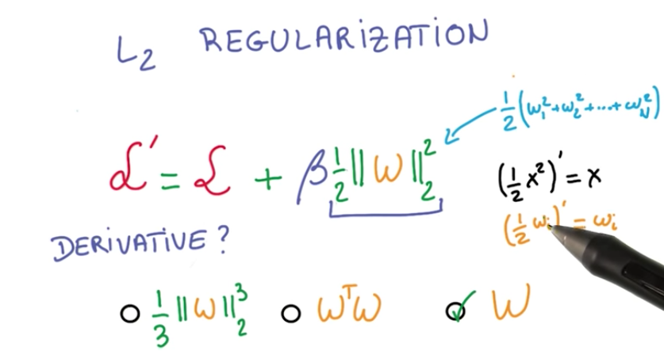

## Dropout

Dropout is a recent technique that also prevents overfitting and improve the overall result of the neural network, in the same way an ensemble model work.

It consists of randomly dropping data flows through the nodes of the neural network.

This way, the neural network is forced to learn redundant representations of the data.

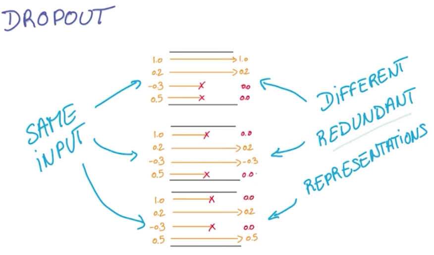

If dropout doesn't improve a neural network, it maybe wise to incrase the number of nodes.

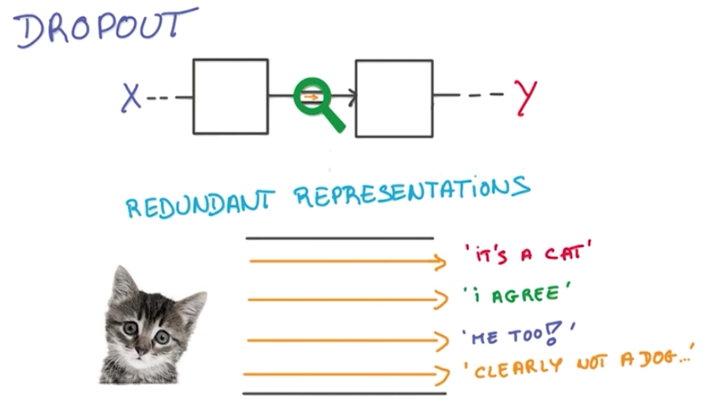

Like an ensemble model, when we evaluate the model, we don't want to deal with the randomness of the dropout affecting the activations. Because of this, we scale the activations that were not affected by 2 and take the average.

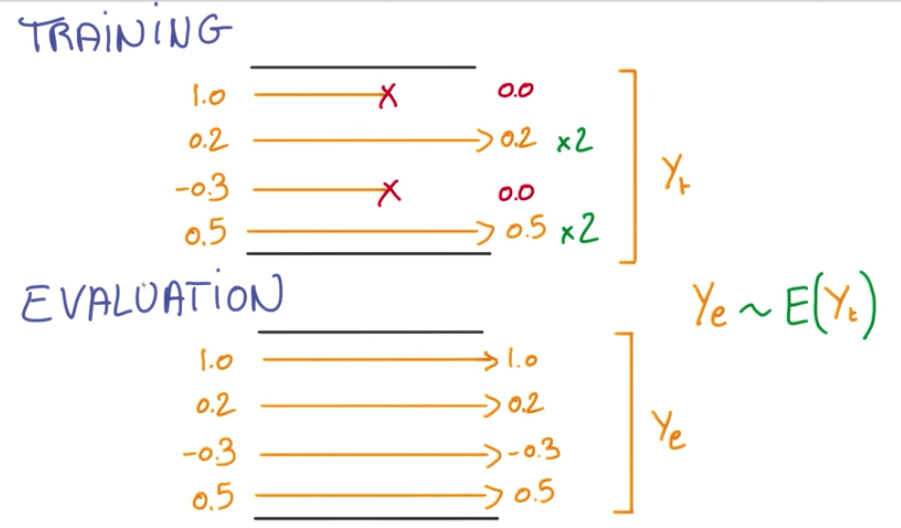

And when it is time to evaluate the network, we remove the dropouts and the scale, and we'll have the same average.

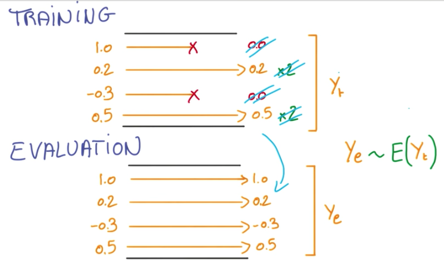