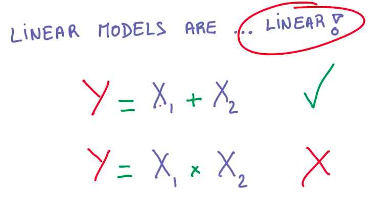
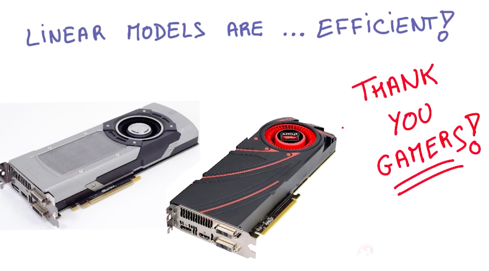
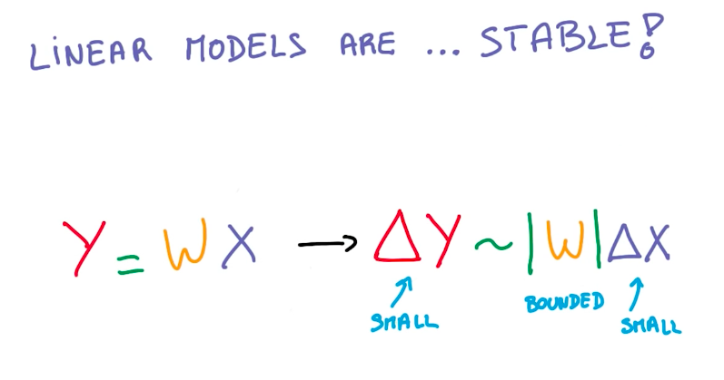
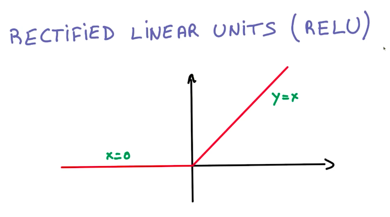
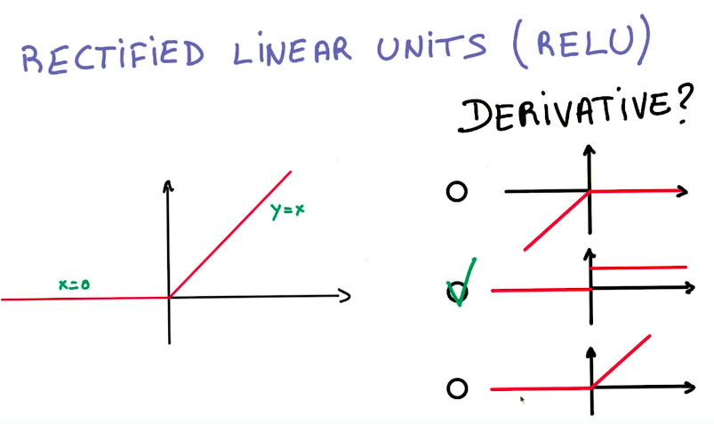
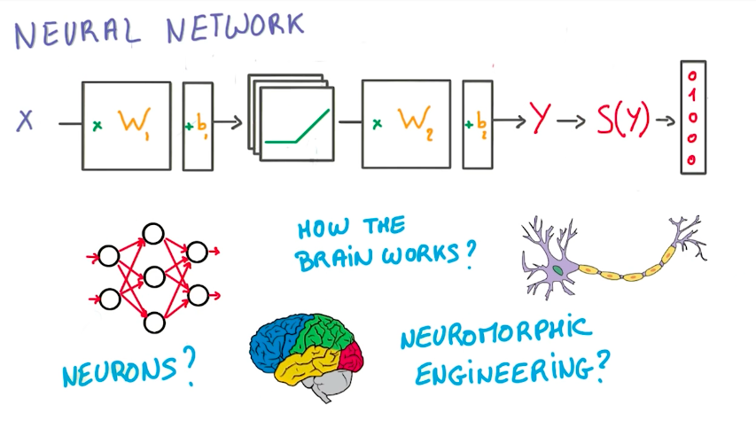
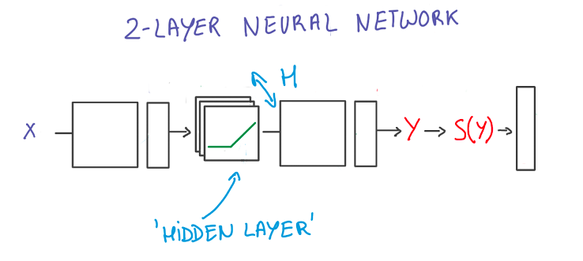

# Deep Neural Networks

Linear models provide various benefits:

So we want to keep using linear models. But we need to introduce some non-linearity into these models to better represent other functions. Multiplying `W` by linear functions, doesn't solve this problem.

The easiest way to introduce non-linearities is to use the Rectified Linear Unit functions (RELU).

And the derivative from this function is also easy to compute.

So using RELUs, we can introduce non-linearities into our model and build our first neural network.

But where are the neurons?

In this class, we won't make analogies to the biological neuroscience side of neural networks. Instead, we will focus on the math behind it, and how we can use GPUs to make them work with little effort as possible.

## Neural Networks

**Note**: Depicted above is a "2-layer" neural network:

1. The first layer effectively consists of the set of weights and biases applied to X and passed through ReLUs. The output of this layer is fed to the next one, but is not observable outside the network, hence it is known as a *hidden layer*.
2. The second layer consists of the weights and biases applied to these intermediate outputs, followed by the softmax function to generate probabilities.