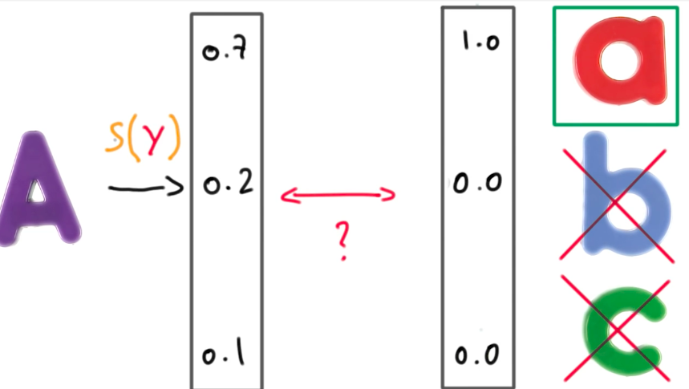
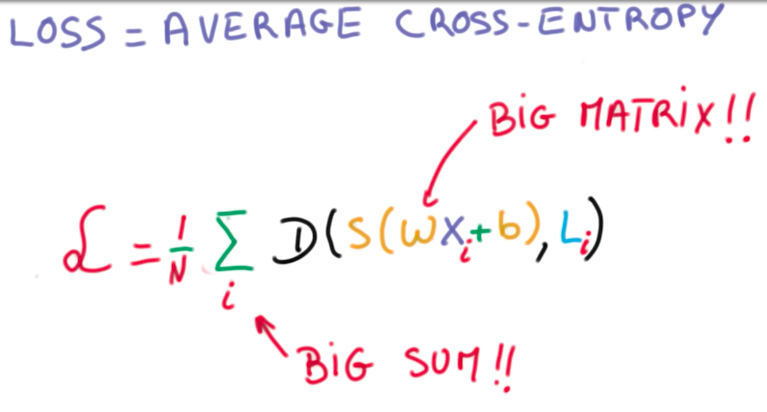
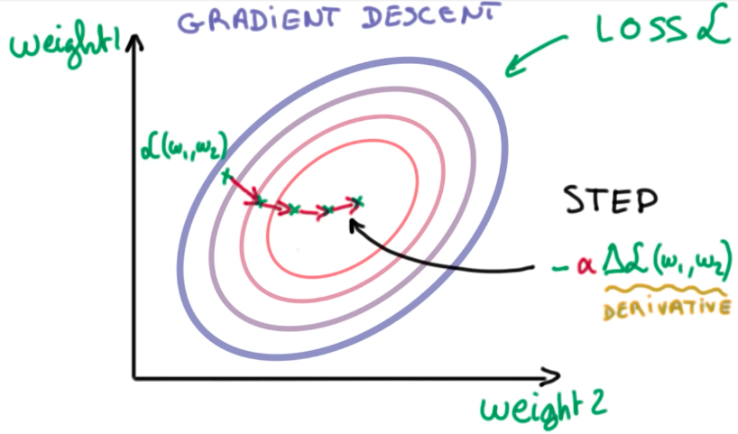

# From Machine Learning to Deep Learning

## Training your Logistic Classifier

A Logistic Classifier is a function that outputs scores for a given input. It is trained by adapting the weights and the bias.

When we train a classifier, we want to output probabilities, instead of scores. This probabilities will be checked against a threshold so that we have a binary classification.

To transform scores into probabilities we can use a softmax function as described below.

## Cross Entropy

## Minimizing Cross Entropy

We want to find the `W` and `b` that provide a high distance to the incorrect class while having a low distance to the correct class.

For this, we define something called `loss function`:

This loss function is the average cross-entropy of all our data, so it is a big expensive operation. To understand how to minimize this function, suppose we could represent it in terms of 2 weights (W and b):

Now we turned our machine learning problem into a numerical optimization problem. We have to find the 2 weights that provide the minimal loss function. And we can do this using gradient descent.

