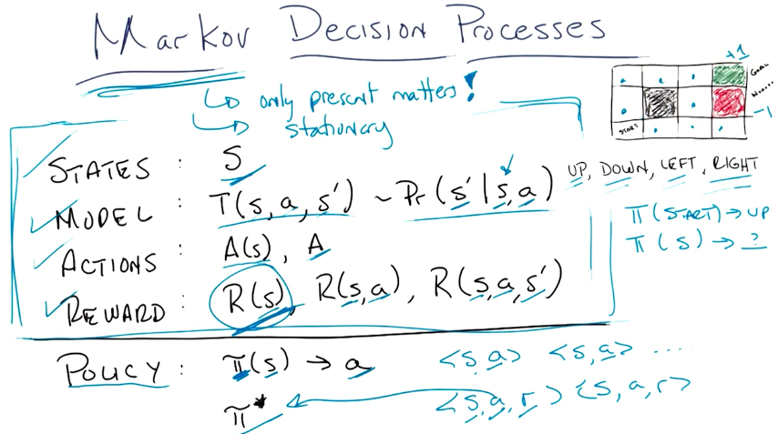

# Markov Decision Process

## Comparison of Learning Types

In *Supervised Learning*, we are given `y` and `x` and we try to find the best function `f` that fits `f(x) = y`.

In *Unsupervised Learning*, we are given `x` and we try to find the best function `f` that produces a compact description of `x` in the form of `f(x)` clusters.

In *Reinforcement Learning*, we are given `x` and `z` and we try to find `f` and `y`, where `f(x) = y`. It looks a lot like supervised learning, but the main difference is that we are not given the labels (`y`), but instead the reinforcers and punishers (`z`) to adjust the function `f`.

## Markov Decision Process Explained

### Markov Assumptions
- Stationary. Actions, states and the model can't change. The agent is the only element of change on the model.
- Only present matters. The transition function should only evaluate the current state to determine the probability of the outcome.

### Image Explained

- States: `S` - represents all the possible states that the agent may be in.
- Model: `T(s, a, s') -> Pr(s' | s, a)` - represents the transition function, which outputs the probability of the agent reaching state `s'` by taking action `a`, given that it is in state `s`.
- Actions: `A(s) or A` - represents all possible actions for each state. Actions are usually constant for all states, so they are represented by `A`.
- Reward  - represents the agent's reward
    - `R(s)`: being on state `s`
    - `R(s,a)`: being on state `s` and taking action `a`
    - `R(s,a,s')`:  being on state `s`, taking action `a` and achieving state `s'`.
    - All these representations provide the same mathematical value and can be modeled by `R(s)` alone.
- Policy - represents the "master plan" to solve the problem. It is represented by the function `π(s) = a`, where for any given state `s` it outputs the best course of action `a` to take.
    - `π*` represents the optimal solution - the function that maximizes the rewards.
