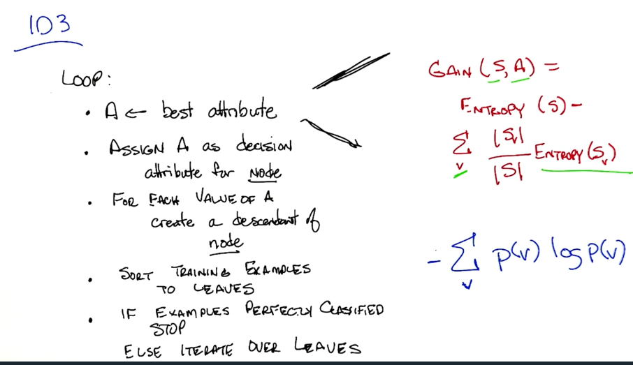

# Classification Learning

## Terms

- **Instances** (aka input) are vector of attributes that defines whatever the input space is.
- **Concept** is a function that maps the inputs into outputs.
- **Target Concept** is the actual answer. It is the concrete function that maps the inputs into outputs.
- **Hypothesis class** is the set of all concepts that we are willing to study to find the target concept.
- **Sample** (aka training set) is a set of all the inputs paired with their expected output that will be used to improve the concept.
- **Candidate** is a concept that might be the target concept
- **Testing Set** is a set of all inputs paired with their expected output that will be used to validate the candidate.

## Decision Trees: Learning

Decision Trees algorithms are as following:

1. Pick the attribute that splits the data the best.
2. Ask the question about the attribute.
3. Follow the answer path
4. Go to 1, until the answer is found.

## ID3

A top down learning algorithm.

### Bias of ID3 

## Decision Trees: Other considerations

Dealing with overfitting

For continuous 
- For continuous inputs, we create discrete attributes by using ranges of values. Example: age between 20 and 30 - age is continuous but ages between 20 and 30 is a true-false question.
- Prunning: collapse leaves if errors are acceptable.

### Pruning

Pruning is a technique in machine learning that reduces the size of decision trees by removing sections of the tree that provide little power to classify instances. Pruning reduces the complexity of the final classifier, and hence improves predictive accuracy by the reduction of overfitting. 

- [Wikipedia](https://en.wikipedia.org/wiki/Pruning_(decision_trees))

## Decision Trees: Wrap up

- Decision tree representation
- Top down algorithm for inducing a decision tree (ID3)
- Expressiveness of DTs
- Bias of ID3
- Best attributes (`Gain(S,A)`)
- Dealing with overfitting (pruning)

