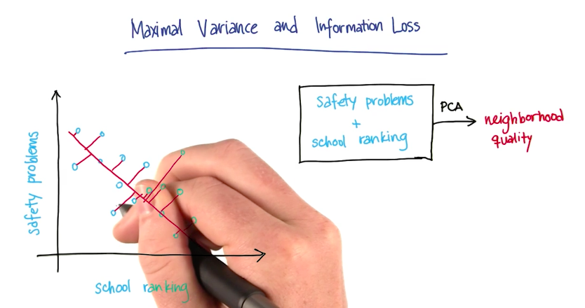
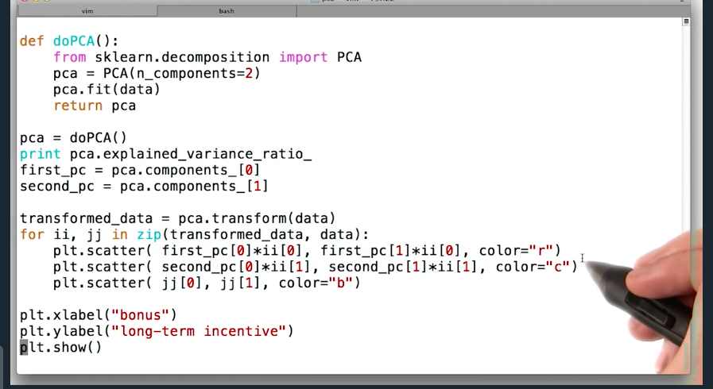

# Dimensionality Reduction

## Principal Component Analysis

### Definition

### When to use PCA

### PCA in sklearn

## Feature Transformation

### Definition

### Independent Component Analysis

Independent component analysis (ICA) is a method in which the goal is to find a linear representation of nongaussian data so that the components are statistically independent, or as independent as possible. [This paper](http://mlsp.cs.cmu.edu/courses/fall2012/lectures/ICA_Hyvarinen.pdf) describes ICA in detail.

[The cocktail party demo](http://research.ics.aalto.fi/ica/cocktail/cocktail_en.cgi) is an example of ICA application

