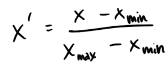
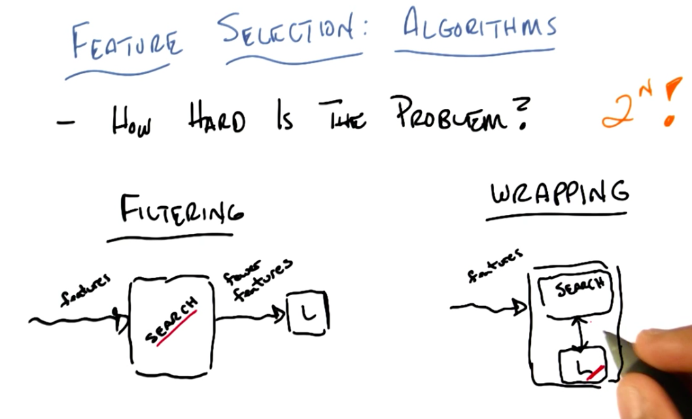
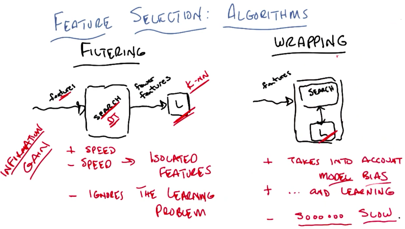
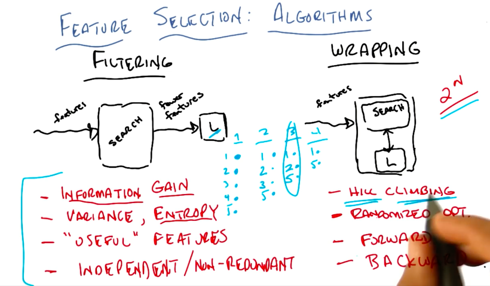
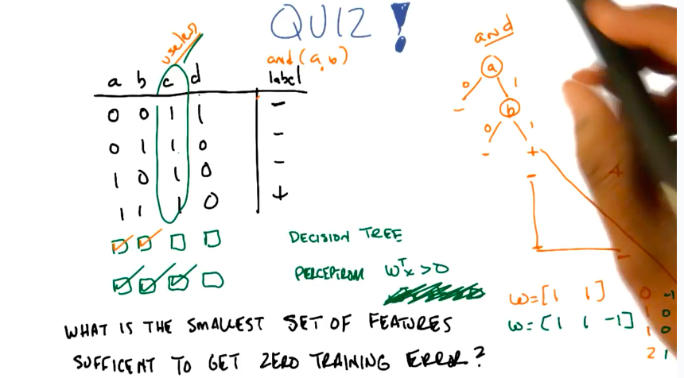
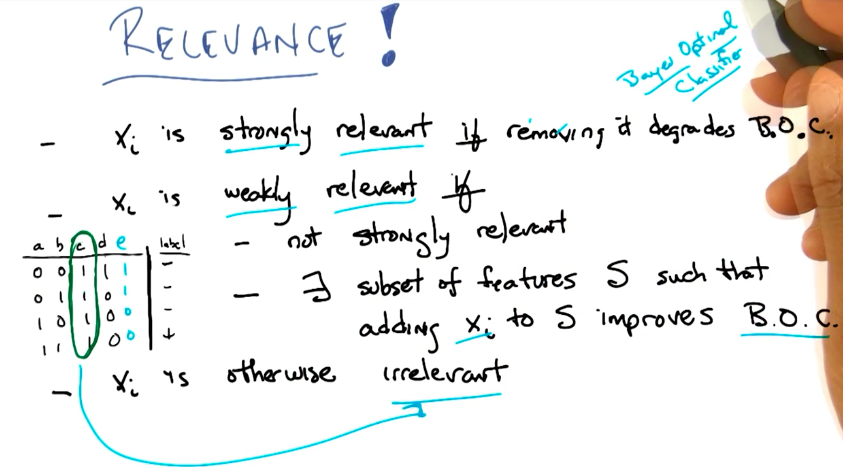

# Feature Engineering

## Feature Scaling



### Min Max Rescaler Coding Quiz

```python
""" quiz materials for feature scaling clustering """

### FYI, the most straightforward implementation might 
### throw a divide-by-zero error, if the min and max
### values are the same
### but think about this for a second--that means that every
### data point has the same value for that feature!  
### why would you rescale it?  Or even use it at all?
def featureScaling(arr):
    min_x = min(arr)
    value_range = max(arr) - min_x
    
    if value_range == 0:
        return [1 for x in arr]
    
    return [float(x - min_x) / value_range for x in arr]

# tests of your feature scaler--line below is input data
data = [115, 140, 175]
print featureScaling(data)

```

### Min Max Rescaler in sklearn


### Quiz: Algorithms affected by feature rescaling

- Decision Trees
- SVM with RBF Kernel
- Linear Regression
- K-means clustering

**Answer:** SVM and K-means are affected by feature rescaling. For instance, take the feature rescaling example where `weight` and `height` were rescaled, so that their contributions to the outcome would be the same (i.e: between 0 and 1). Because SVM and K-means compute distances, scaling the features would affect the calculated distances and therefore would affect the result.

In contrast, Decision Trees and Linear Regression don't measure distances. Decision Trees define for each feature available some constant value in order to split the data. So if we scale that feature, we will be scaling the constant split value by the same amount and the result won't be changed. In a similar way, Linear Regression defines coefficients for each feature available, so they are independent from each other and rescaling the features won't change the results 

## Feature Selection

### Why Feature Selection?

- Knowledge Discovery: usually we don't need all the features to solve a problem. Also, selecting the important features allow us to understand, interpret, visualize and get more insights about the problem.
    - Interpretability
    - Insight
- Curse of dimensionality: to correctly fit a model, we need 2<sup>n</sup> training data, where `n` is the number of features of our model.

### How hard is feature selection?

Feature selection is defined as:
    
    F(N) -> M, where M ≤ N

To select all *M* relevant features from *N*, without knowing *M*, we need to try all subsets of *N*. This give us  combinations, which, if we don't know *m* equals *2<sup>n</sup>* possibilities.

### Filtering and Wrapping Overview



### Filtering and Wrapping Comparison



- `Filtering` is a straightforward process where the search algorithm and the learner don't interact.
- In contrast, in `wrapping` the learner gives feedback to the search algorithm about which features are impacting the learning process. Because of this, it is slower than filtering.
- As an example, one could use a Decision Tree as a search algorithm for filtering. This DT would be trained until overfitting, thus maximizing information gain (the filtering criterion). Then we would extract the selected features from the flattened DT and input them into another learner, for example: KNN. In this setup, KNN's major setback, which is needing too much train data to fit the model to all features available, would be dealt with by the filtering done by the DT.



- In the lesson, the teacher shows us how filtering uses the labeled data to get to the best results, while wrapping uses the bias of the learning algorithm to select the best features.
- Examples of wrapping setups are:
    - hill climbing
    - randomized optimization
    - forward sequential selection
    - backward elimination

### Minimum Features Quiz



- The quiz asks the student to select the minimum features needed to minimize erros to (1) a Decision Tree, (2) an origin limited perceptron.
- The solution involves testing the features using some filtering or wrapping algorithm, in trial-and-error fashion.
- My solution was based on the insight that the predicted function is `a AND b`. Because of that is easy to note what features are necessary to minimize the error for both learners. 

### Feature Relevance



1. A feature x<sub>i</sub> is *strongly relevant* if removing it degrades the Bayes Optimal Classifier (BOC)
2. A feature x<sub>i</sub> is *weakly relevant* if:
    - it is not *strongly relevant*
    - exists a subset of features S that by adding x<sub>i</sub> to S, improves BOC
3. otherwise the feature x<sub>i</sub> is irrelevant

- In the `AND quiz-example`, the teacher shows that the features `a` and `b`are *strongly relevant*, since the function is `a AND b` and we need both to correctly predict the result.
- By adding another feature `e` equal to `not a`, we make both `a` and `e` *weakly relevant*, because without one of them, we can still use the other to predict the result of `a AND b` (or `NOT e AND b`).
- The other features `c` and `d` are *irrelevant*, but not *useless* as we'll see next. 
