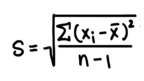

# Mean

## Arithmetic Mean

## Geometric Mean

## Harmonic Mean

## Mean of Probability Distribution

---

# Mode

The mode of a sample is the element that occurs most often in the collection. For example, the mode of the sample [1, 3, 6, 6, 6, 6, 7, 7, 12, 12, 17] is 6.

---

# Median

---

# Standard Deviation and Variance

## Variance

The variance of a random variable `X` is the [expected value](https://en.wikipedia.org/wiki/Expected_value) of the squared deviation from the [mean](https://en.wikipedia.org/wiki/Mean) of `X`:

    Var(X) = E[(X - μ)²]

Usually the expected value for most distributions is the arithmetic mean:

%3D%5Csum%7B(x_i-%5cbar%7bx%7d)^2%7D)

## Standard Deviation

Standard deviation is the square root of the variance.

## Example

Example:
The marks of a class of eight students (that is, a population) are the following eight values:

For example, the marks of a class of eight students (that is, a **[population](https://en.wikipedia.org/wiki/Statistical_population)**) are the following eight values:

These eight data points have the mean (average) of 5:

First, calculate the deviations of each data point from the mean, and square the result of each:

The [variance](https://en.wikipedia.org/wiki/Variance) is the mean of these values:

and the _population_ standard deviation is equal to the square root of the variance:

---

# Normal Distribution

## Probability Density

---

# Bessels Correction

## Sample standard deviation

This is used to approximate standard deviation of the population, from a standar deviation of a sample.

**Reference:** [Wikipedia](https://en.wikipedia.org/wiki/Statistical_dispersion)
